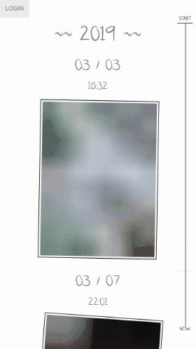
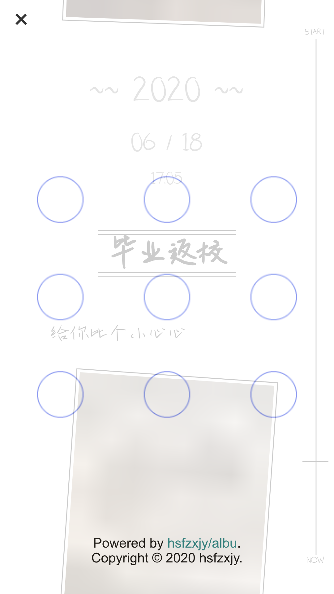
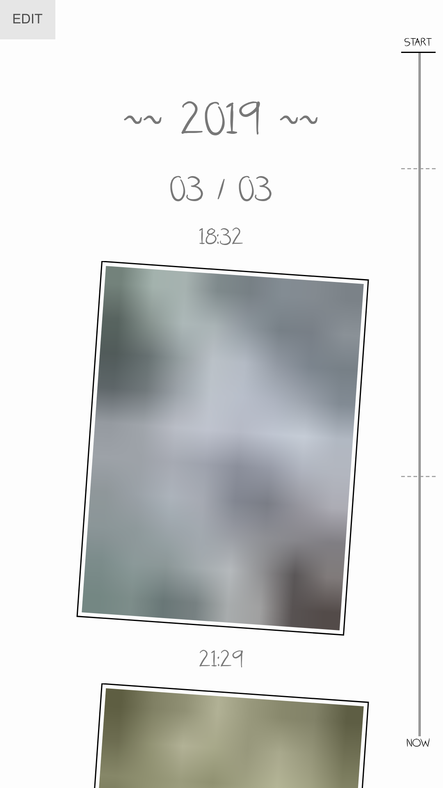
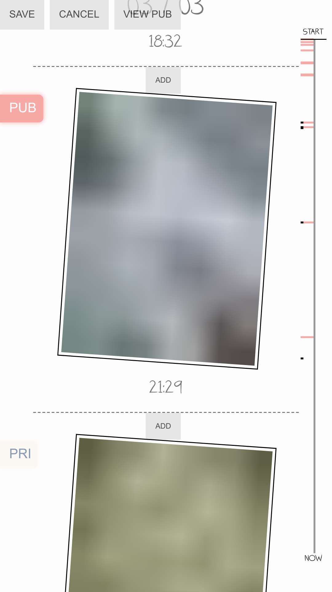
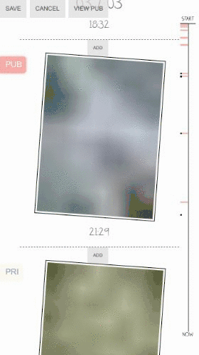
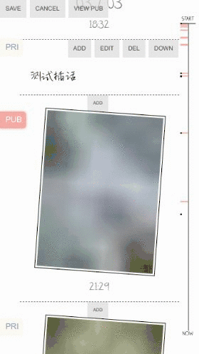
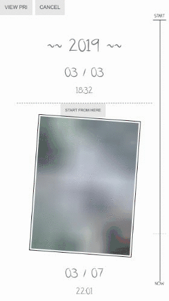
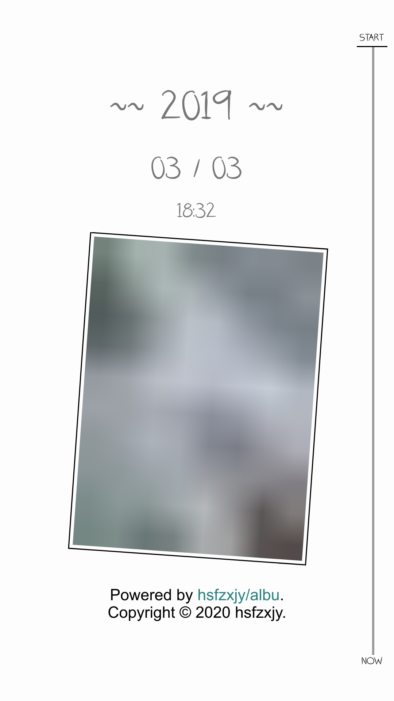

# 使用示例

目前 `albu` 仅支持移动端。

部署完成后，打开相应网址，会进入公开相册页面。在此，任何人可以浏览公开的照片、插话和里程碑。所有的内容以时间排序。

## 公开相册

页面的右侧为可拖动的时间轴，用于快速导航至指定的时间点。

点击左上角的「LOGIN」按钮，可打开登录界面。在此绘制自定义的解锁手势，可以查看被设置为私密的内容。

## 私密相册

登录成功后，即进入私密相册界面。

### 编辑

点击左上角的「EDIT」按钮，可打开编辑界面。

在此，可以在照片的间隙加入插话或是里程碑。

插话/里程碑上方的按钮可用于调整位置或修改文字。

所有内容左侧的 「PUB」/「PRI」 按钮可用于切换该内容的「公开」/「私密」状态。

编辑完成后，点击 「SAVE」/「CANCEL」 按钮保存 / 放弃修改。

### 公开视图

点击「VIEW PUB」按钮，可以预览公开相册的效果。

### 自定义分享

点击「SHARE」按钮，可以选择一个时间段作自定义分享。

此处键入的标题将作为被分享网页的标题（即 document.title）。此链接打开后，相册只会展示被选择时间段中的内容。

